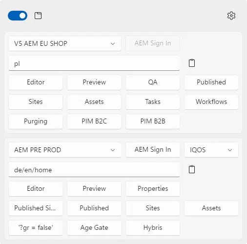
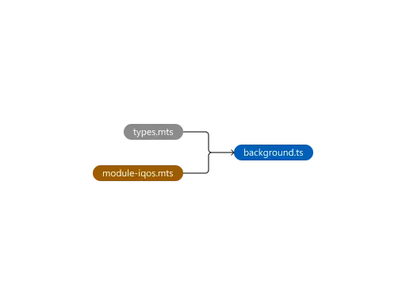
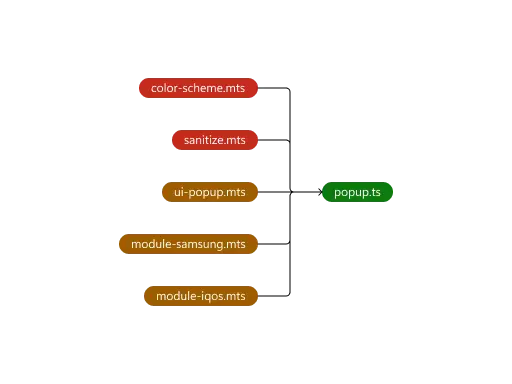
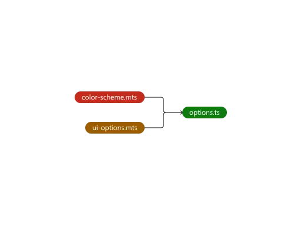
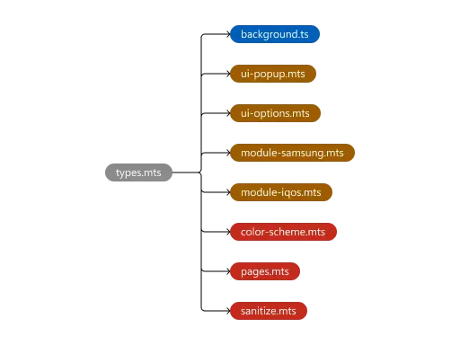
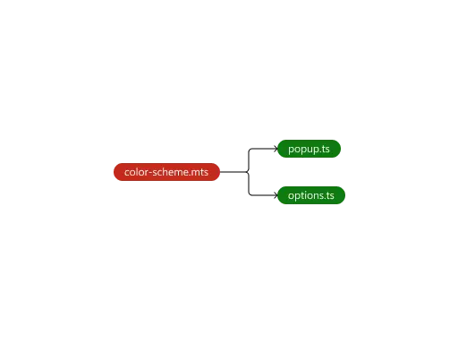
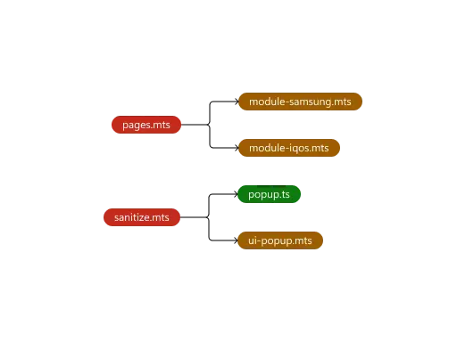

# Extension

## How to install the extension?

1. Navigate to an `edge://extensions/` page. Alternatively, open this page by clicking on the **Extensions** menu and the **Manage extensions** button.
2. Enable the **Developer mode**.
3. Click the **Load unpacked** button and select the extension's directory.

## How does the extension work?

We select a version of the AEM we want to work with, we enter a url address of a page we want to open and then we open it in a selected mode.

## HTML

<picture>
  <source media="(prefers-color-scheme: light)" srcset="assets/webp/light/popup-page.webp" type="image/webp">
  <source media="(prefers-color-scheme: dark)" srcset="assets/webp/dark/popup-page.webp" type="image/webp">
  
</picture>

The extension consists of two pages: [popup.html](prod/html/popup.html) and [options.html](prod/html/options.html). The popup page can be accessed by interacting with an extension's icon or by pressing assigned keyboard shortcuts. The options page can be accessed by using a shortcut present on the popup page.

## CSS

The extension’s stylesheet was written in [Sass](https://sass-lang.com/). A source code has been divided into modules. [popup.scss](dev/scss/popup.scss) and [options.scss](dev/scss/options.scss) files import partials of specific components each page is built of and define each page’s layout.

Interface design follows Microsoft's [Fluent Design System](https://www.microsoft.com/design/fluent) used in Windows 11. An official documentation and the Figma design toolkit were used as an implementation basis. The component library follows the [BEM](https://en.bem.info/) methodology. The [Popper](https://popper.js.org/) package was used for tooltip positioning.

## JS

An extension’s logic was written in [TypeScript](https://www.typescriptlang.org/). A source code has been divided into modules. Following diagrams show export / import dependencies between modules. The extension uses the [Chrome Extensions](https://developer.chrome.com/docs/extensions) API.

<picture>
  <source media="(prefers-color-scheme: light)" srcset="assets/webp/light/background.webp" type="image/webp">
  <source media="(prefers-color-scheme: dark)" srcset="assets/webp/dark/background.webp" type="image/webp">
  
</picture>

A [background.ts](dev/ts/background.ts) service worker initializes storage variables that define states of various components. Additionally, it listens for keyboard shortcuts that inject functions into a specified tab.

<picture>
  <source media="(prefers-color-scheme: light)" srcset="assets/webp/light/popup.webp" type="image/webp">
  <source media="(prefers-color-scheme: dark)" srcset="assets/webp/dark/popup.webp" type="image/webp">
  
</picture>

A [popup.ts](dev/ts/popup.ts) script listens for various events. Depending on a type of the event and an id attribute of a control element, a specified storage variable is updated or a page with a given url address is created. A [ui-popup.mts](dev/ts/modules/ui-popup.mts) module contains functions that update states of components on the popup page.

[module-samsung.mts](dev/ts/modules/module-samsung.mts) and [module-iqos.mts](dev/ts/modules/module-iqos.mts) modules contain sets of functions that generate new url addresses for selected environments.

<picture>
  <source media="(prefers-color-scheme: light)" srcset="assets/webp/light/options.webp" type="image/webp">
  <source media="(prefers-color-scheme: dark)" srcset="assets/webp/dark/options.webp" type="image/webp">
  
</picture>

An [options.ts](dev/ts/options.ts) script listens for various events. It contains functions that update values of storage variables, enabling extension customization and unlocking additional functionality. A [ui-options.mts](dev/ts/modules/ui-options.mts) module contains functions that update states of components on the options page.

<picture>
  <source media="(prefers-color-scheme: light)" srcset="assets/webp/light/types.webp" type="image/webp">
  <source media="(prefers-color-scheme: dark)" srcset="assets/webp/dark/types.webp" type="image/webp">
  
</picture>

A [types.mts](dev/ts/modules/types.mts) module exports types used by TypeScript for type checking.

<picture>
  <source media="(prefers-color-scheme: light)" srcset="assets/webp/light/color-scheme.webp" type="image/webp">
  <source media="(prefers-color-scheme: dark)" srcset="assets/webp/dark/color-scheme.webp" type="image/webp">
  
</picture>

A [color-scheme.mts](dev/ts/modules/color-scheme.mts) module contains functions that update a page's color scheme / interface’s theme.

<picture>
  <source media="(prefers-color-scheme: light)" srcset="assets/webp/light/pages_sanitize.webp" type="image/webp">
  <source media="(prefers-color-scheme: dark)" srcset="assets/webp/dark/pages_sanitize.webp" type="image/webp">
  
</picture>

A [pages.mts](dev/ts/modules/pages.mts) module contains a function that creates a new page with a given url address passed as a parameter. It is called every time a user interacts with button controls generating new url addresses.

A [sanitize.mts](dev/ts/modules/sanitize.mts) module contains a set of functions that remove unnecessary characters from a url address passed as a parameter. It is called each time a user interacts with input controls.
